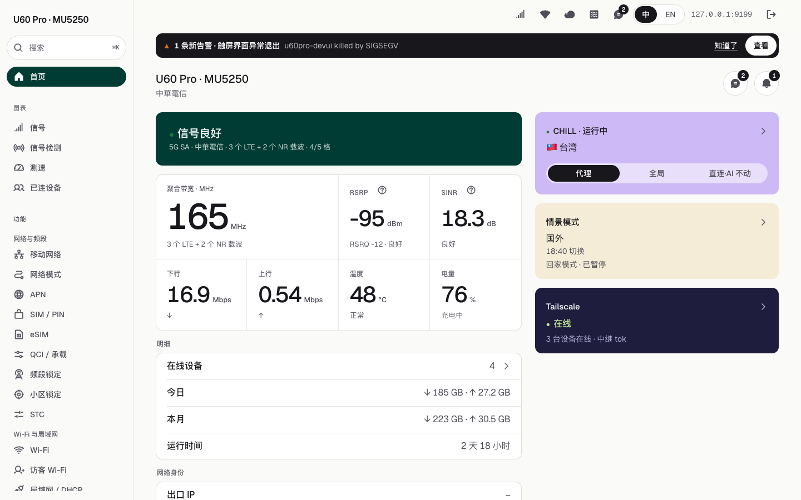
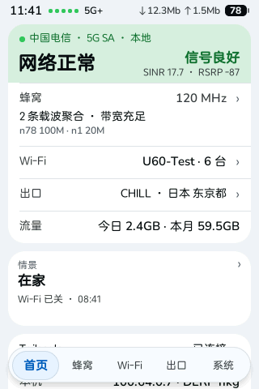
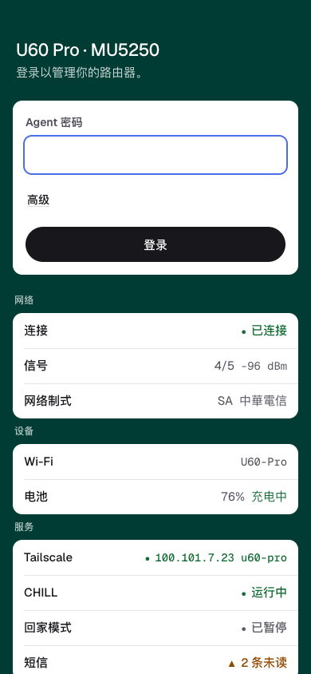
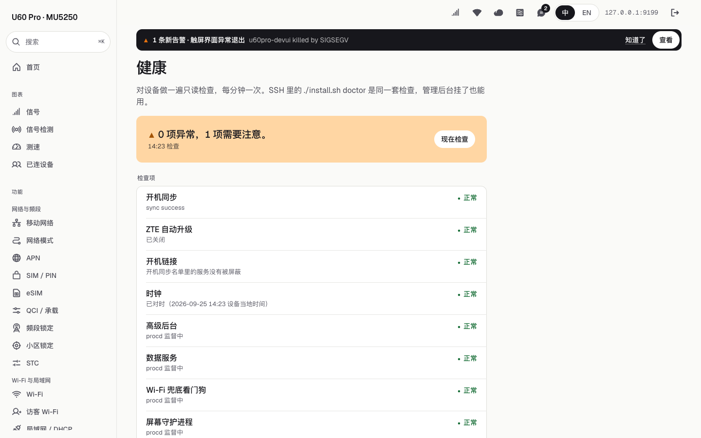
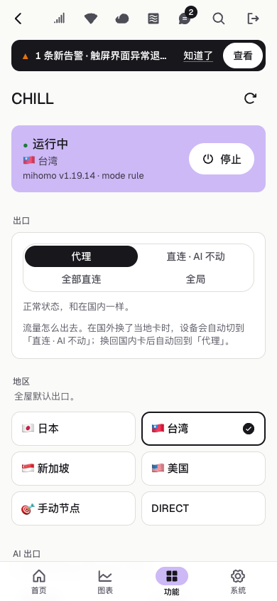

# 快速上手：从零到一台装好的 U60 Pro（MU5250）

这份指南把三个仓库串起来讲：它们各是什么、怎么编出装机包、怎么装到设备上、装完怎么检查、出了问题怎么退回去。
面向第一次接触这个项目的人。每条命令都来自仓库里现有的脚本，参数以脚本为准。

> **先说清楚两件事**
> 1. 这是非官方改装，和中兴（ZTE）无关，风险自负。只在你自己的设备上用。
> 2. **目前不发布编译好的二进制**（许可证清单还没做完），装机包需要你自己编：一条命令，下面第 3 节讲。
>    如果身边有人已经打好了装机包，直接跳到[第 4 节](#4-安装)。

## 1. 三个仓库各管什么

| 仓库 | 在设备上是什么 | 作用 |
|---|---|---|
| [zte-u60-pro-mu5250-manager](https://github.com/faying/zte-u60-pro-mu5250-manager)（本仓库） | `zte-agent`（:9090）+ `/data/admin/` 管理网页 | 设备的 REST API、浏览器里的高级后台、eSIM、CHILL 代理控制，**以及装机包（`onboard/`）** |
| [zte-u60-pro-mu5250-touch-ui](https://github.com/faying/zte-u60-pro-mu5250-touch-ui) | `/data/plugins/u60pro-devui/` | 前面板触屏界面（LVGL）、屏幕守护进程 `u60-uid`、进程监督和 Wi-Fi 兜底脚本 |
| [zte-u60-pro-mu5250-data-service](https://github.com/faying/zte-u60-pro-mu5250-data-service) | `/data/plugins/zwrt-datad/` | `zwrt-datad`：把 ubus/uci/sysfs 整理成 JSON，本机 `127.0.0.1:9460` 提供 `/state` 和 SSE |

它们在设备上这样连起来：

```
zwrt-datad :9460 ──▶ 触屏界面 u60pro-devui ──(eSIM 页)──▶ zte-agent :9090 ──▶ lpac（/data/esim）──▶ eUICC 卡
浏览器 ──▶ zte-agent :9090（API + 管理网页）
```

三个仓库**一起用**：装机包在 manager 里打，打包时从 touch-ui 取触屏程序和脚本，从 data-service 取 `zwrt-datad`。

装好后的样子（截图用的是假数据）：

| 管理网页 | 触屏首页 |
|---|---|
|  |  |

## 2. 准备

**设备**

- ZTE U60 Pro（MU5250），**固件 B27 或更早**（网页后台「设备信息」里形如 `…MU5250V1.0.0B27`）。
  B28 起中兴删掉了开 USB 调试（ADB）的接口，装机包就用不了了。**装之前千万别升级固件。**
- 路由器管理密码（登录 `http://192.168.0.1` 用的那个）。装机脚本用它通过网页接口打开 ADB，之后装上只认密钥的 SSH（端口 2222）。
- 一根能传数据的 USB-C 线。
- 要用 eSIM 的话，一张可插拔 eUICC 卡（5ber、eSTK.me 这类）。

**装机的电脑**（macOS / Linux / Windows 的 Git Bash 都行）：`adb`、`ssh`、`curl`。

- macOS：`brew install android-platform-tools`
- Linux：`sudo apt install adb`
- Windows：Google SDK Platform-Tools（加进 PATH）+ Git for Windows

**打包的电脑**（编译用，可以是同一台）：

| 要编的东西 | 需要 |
|---|---|
| 全部 | **Docker**（Docker Desktop 即可）、`git`、`curl`、`python3`、`unzip`、能上网 |
| 管理网页 | Node.js + npm |
| zte-agent | 有 `cargo-zigbuild` 就用，没有自动走 Docker |

不用装任何交叉工具链：触屏程序、`zwrt-datad`、eSIM 工具、字体都在 Docker 里编或生成。
macOS（Apple 芯片或 Intel）、x86_64 Linux 都验证过能用；触屏程序的工具链是 x86_64 程序，Apple 芯片上走 amd64 模拟，慢一些。

## 3. 编出装机包

三个仓库并排放在同一个目录下，**只要这三个公开仓库就能打出完整的装机包，不需要从任何已经装好的设备上拉东西**：

```sh
mkdir u60 && cd u60
git clone https://github.com/faying/zte-u60-pro-mu5250-manager.git
git clone https://github.com/faying/zte-u60-pro-mu5250-touch-ui.git
git clone https://github.com/faying/zte-u60-pro-mu5250-data-service.git
cd zte-u60-pro-mu5250-manager
./onboard/build-kit.sh
# → onboard/dist/u60-kit-YYYYMMDD.tar.gz
```

第一次跑要下载 Docker 镜像和依赖，大约二三十分钟；之后有缓存（`onboard/cache/`、各仓库的 `out/`、`rust/target-zig/`），快很多。
`build-kit.sh` 按顺序做这些事（每样东西从哪来、怎么校验）：

| 包里的东西 | 从哪来 |
|---|---|
| dropbear（SSH） | OpenWrt 23.05.4 官方 ipk，sha256 固定 |
| zte-agent、管理网页 | 本仓库现编 |
| 触屏程序 + u60-uid | touch-ui 的 `scripts/build-docker.sh`（Docker；LVGL v9.5.0、FreeType 2.13.3），产物在 touch-ui 的 `out/` |
| 触屏字体 | Nunito（google/fonts 固定提交）和中文兜底字体（Resource Han Rounded 子集），都是 OFL，sha256 固定，Docker 里生成。设备自带的中兴字体不打包，触屏直接读设备上的 `/usr/ui/fonts/` |
| zwrt-datad | data-service 的 `scripts/build-docker.sh`（Docker 里 cargo-zigbuild，镜像按 digest 固定，`Cargo.lock` 锁依赖） |
| eSIM 工具（lpac） | `scripts/esim/build-esim-bundle.sh --out`：Alpine 3.24 的 lpac 和依赖库（`scripts/esim/alpine.lock` 钉版本和 sha256）+ statx 兼容垫片 + `qmi_uim_probe` |
| CHILL（可选） | mihomo、zashboard 官方发布包（sha256 固定）+ 规则集（下载当时的最新版）。不要就加 `CHILL=0` |
| 进程监督、体检脚本 | touch-ui 的 `scripts/` |

打包前会检查：触屏程序必须是 LVGL 版（不是 `scripts/build.sh` 编的旧 litehtml 版）；`zwrt-datad` 必须是 Rust 版、没有写死的外部更新源。不对就停。

也可以分开编，再告诉 `build-kit.sh` 用现成的文件：

```sh
(cd ../zte-u60-pro-mu5250-touch-ui && scripts/build-docker.sh)        # → out/u60pro-devui-lvgl.stripped、out/u60-uid（默认就读这里）
(cd ../zte-u60-pro-mu5250-data-service && scripts/build-docker.sh)    # → zwrt-datad-aarch64
DATAD_BIN=../zte-u60-pro-mu5250-data-service/zwrt-datad-aarch64 ./onboard/build-kit.sh
```

其他变量：`DEVUI_BIN` / `UID_BIN`（触屏二进制）、`ESIM_TGZ`（现成的 eSIM 包）、`DEVUI_FONTS_DIR`（现成的字体目录）、`FONTS=0`（不带字体）、
`DEVUI_REPO` / `DATAD_REPO`（仓库不在旁边时）。常用的可以写进 `onboard/kit.local.env`（一行一个 `KEY=值`，不进 git）。

> **eSIM 包打不出来？** Alpine 3.24 出安全更新时会替换钉住的包，旧文件从镜像上消失。这时跑
> `python3 scripts/esim/alpine_closure.py --relock` 重新解析，重打后先在一台设备上确认 `/data/esim/lpac.sh chip info` 能读卡，再用。
> 规则集（CHILL）不钉版本，每次打包取当时的最新版。

## 4. 安装

```sh
tar xzf u60-kit-*.tar.gz
cd u60-kit
./install.sh
```

照着提示做：

1. 电脑连上 U60 的 **Wi-Fi**，输入路由器管理密码，脚本通过网页接口打开 USB 调试。
2. 提示等 ADB 设备时，用 USB-C 线把 U60 接到电脑。
3. 设一个**高级后台密码**（直接回车 = 和路由器管理密码相同）。
4. 自动推送、安装、验证，一两分钟。屏幕会闪一下，换成新界面。
5. 问要不要重启验证时建议选是，脚本会确认 SSH、后台、屏幕在重启后都自己起来了。

全套是 `ssh admin devui esim` 四个组件。也可以只装其中几样：

```sh
./install.sh ssh               # 只开 ADB + 装持久化 SSH
./install.sh ssh admin devui   # 不要 eSIM
./install.sh chill             # CHILL 代理，不在全套里，要单独点名（见第 7 节）
```

装 SSH 时会顺便**关掉固件自动升级**。U60 的地址不是 `192.168.0.1` 时，在命令前加 `GATEWAY=你的地址`。
没有终端（比如让 Claude Code 代装）时，密码从环境变量 `ROUTER_PASSWORD`、`AGENT_PASSWORD` 或包里的 `u60.env` 读（模板 `u60.env.example`）。

装机包自带的 [README](../onboard/README.md) 写得更细：装到了哪些路径、日常用法、常见问题。

## 5. 检查装好了没有

```sh
./install.sh status     # 各组件在不在、在不在跑
./install.sh doctor     # 只读体检：开机同步、自动升级、各服务、心跳、Wi-Fi、告警……
```

然后：

- 浏览器打开 `http://192.168.0.1:9090/`，用高级后台密码登录。
- SSH：`ssh -p 2222 root@192.168.0.1`（只认密钥；装完脚本会打印一段可以加进 `~/.ssh/config` 的配置）。
- 后台「健康」页和 `doctor` 是同一套检查，后台打不开时在 SSH 里跑 `sh /data/u60-guard/doctor.sh`。

| 登录页（手机） | 健康页 |
|---|---|
|  |  |

## 6. 更新、备份、退回

**更新**：拿新的装机包，解开后只装要更新的组件（这时走 SSH，不用插线）：

```sh
./install.sh admin      # zte-agent + 管理网页
./install.sh devui      # 触屏界面 + zwrt-datad
./install.sh esim       # eSIM 工具
./install.sh reboot     # 可选：重启一次，确认开机都能自己起来
```

**备份和恢复配置**（只有配置，不含程序；备份里有密码，别外传）：

```sh
./install.sh backup                   # 存到这台电脑的 ./backups/（BACKUP_DIR 可改）
./install.sh restore backups/xxx.tgz  # 先列出会改哪些文件，输入 yes 才写
```

**退回旧版本**：除 CHILL 外，装机脚本不会自动保留上一版程序。要退回，就用旧的装机包再装一次对应组件。
CHILL 更新失败时会自己换回上一版（`.prev`）。触屏程序连续两次起不来时，`u60-uid` 会把屏幕交还原厂界面，
长按屏幕右下角 3 秒可以再切回来。

**卸载**：没有卸载命令，步骤见装机包 README 的「恢复原厂」一节：停掉并删掉 `/etc/init.d/` 下装的几个服务、
用 `/data/u60-kit/rc.local.orig` 换回原来的 `rc.local`、删掉 `/data` 下装的目录、重启。

## 7. CHILL 代理（可选）

CHILL 是设备上的透明代理（原生 mihomo，TUN 模式）加 zashboard 面板，需要你自己的订阅地址。

```sh
./install.sh chill                     # 第一次只装不启动
ssh -p 2222 root@192.168.0.1
cp /data/chill/chill.env.example /data/chill/chill.env && chmod 600 /data/chill/chill.env
vi /data/chill/chill.env               # 写订阅地址
sh /data/chill/chill.sh safe-start     # 启动；确认全屋网络正常后，5 分钟内：
sh /data/chill/chill.sh confirm        # 不确认会自动停掉，免得把自己锁在外面
```

之后在后台「CHILL」页开关、换出口、换档位。



## 8. 新手一定要守的规矩

- **不要升级固件，不要打开固件自动升级。** 升级会覆盖 `/etc/rc.local`（所有自启失效），B28 起又开不了 ADB，回不去。
- **不要 `/etc/init.d/<原厂服务> disable`。** 原厂主守护进程要等配置里的一串服务全部就绪才放行开机，少一个就卡 logo、不拨号、触屏失灵。
- 开机自启只走 `/etc/rc.local`。改之前先备份，改完 `sh -n /etc/rc.local` 检查语法。
- 程序和数据放 `/data`。`/tmp` 是内存盘，重启就没了。不写分区、不 `dd`。
- **屏幕上必须一直有界面。** 几分钟没有任何界面，固件会整机重启。任何停掉一个界面的操作，都要在同一步里起另一个。
- **新编的触屏程序先用别的文件名试跑。** 直接覆盖正式位置 `/data/plugins/u60pro-devui/u60pro-devui`，如果它一启动就崩，
  会被固件升级成整机重启循环。正式位置旁边始终留一份能用的备份。普通用户用 `./install.sh devui` 更新即可。
- 如果你是通过这台 U60 自己的网络远程连进来的，别切到没流量的 eSIM profile，别乱改 APN、网络模式、Wi-Fi，切过去就连不回来了。

## 9. 常见问题

- **一直等不到 ADB 设备**：换线、换 USB 口（别用扩展坞）。`adb devices` 能看到一行 `device` 才算通。Windows 可能要装 Google USB Driver。
- **SSH 连不上**：电脑没连 U60 的 Wi-Fi，或者代理软件的 TUN/增强模式把 `192.168.0.1` 劫走了。在代理里把 `192.168.0.0/16` 设成直连，
  用 `curl` 测时加 `--noproxy '*'`。
- **后台网页打不开但 SSH 通**：多半也是代理。在设备上验证：`wget -q -O- http://127.0.0.1:9090/ | head -c 200`。
- **SSH 偶尔拒绝连接**：dropbear 对太快的重连会拒绝，等几秒再连；多条命令尽量合并到一次 `ssh` 里。
- **屏幕没数据**：`/etc/init.d/zwrt-datad restart`，看 `/tmp/zwrt-datad.log`。
- **网页登录被锁**：原厂网页连续输错 5 次会锁一段时间，脚本会显示剩余次数和倒计时，别连着试。
- **装到一半失败**：`install.sh` 可以反复跑，装好的部分会跳过或覆盖。
- **设备时间看着差几个小时**：固件把当地时间当 UTC 存，后台和触屏都按当地时间显示，这是正常的。
