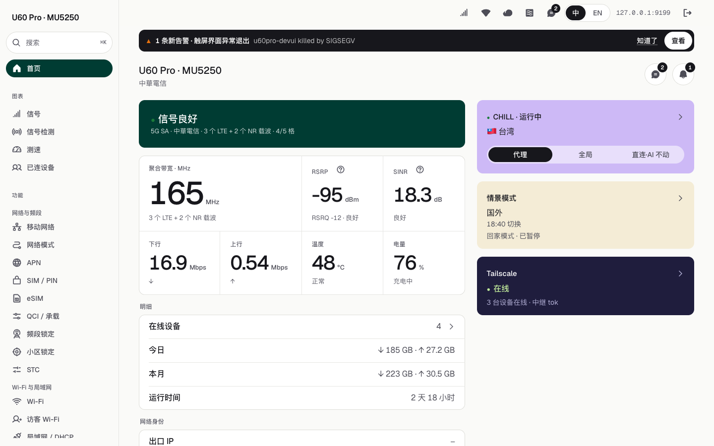
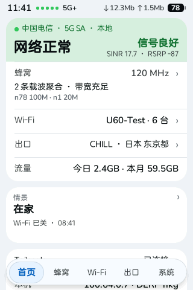
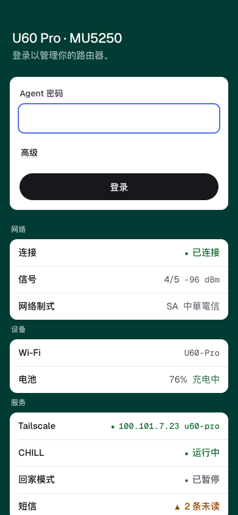
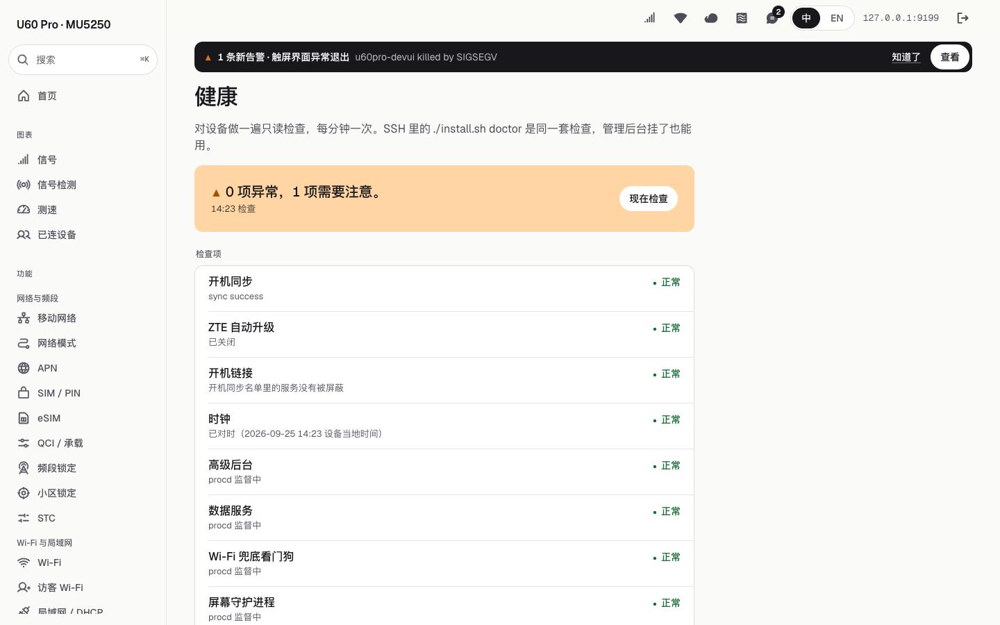

# Getting started: from zero to a fully installed U60 Pro (MU5250)

**English** · [中文](GETTING-STARTED.zh-CN.md)

This guide covers the three repositories together: what each one is, how to build the install kit, how to install it on the device, how to check the result, and how to roll back when something goes wrong.
It is written for people new to this project. Every command comes from scripts already in the repositories; where they differ, the scripts are authoritative.

> **Two things up front**
> 1. This is an unofficial modification, not affiliated with ZTE. Use at your own risk, and only on your own device.
> 2. **No prebuilt binaries are published yet** (the license inventory is not finished), so you build the install kit yourself: one command, covered in section 3.
>    If someone near you already has a built install kit, skip to [section 4](#4-install).

## 1. What each repository does

| Repository | What it is on the device | Purpose |
|---|---|---|
| [zte-u60-pro-mu5250-manager](https://github.com/faying/zte-u60-pro-mu5250-manager) (this repository) | `zte-agent` (:9090) + `/data/admin/` admin web | The device REST API, the advanced admin web in the browser, eSIM, **and the install kit (`onboard/`)** |
| [zte-u60-pro-mu5250-touch-ui](https://github.com/faying/zte-u60-pro-mu5250-touch-ui) | `/data/plugins/u60pro-devui/` | Front-panel touch UI (LVGL), screen daemon `u60-uid`, process supervision and Wi-Fi fallback scripts |
| [zte-u60-pro-mu5250-data-service](https://github.com/faying/zte-u60-pro-mu5250-data-service) | `/data/plugins/zwrt-datad/` | `zwrt-datad`: turns ubus/uci/sysfs into JSON and serves `/state` and SSE locally on `127.0.0.1:9460` |

How they connect on the device:

```
ubus / uci / sysfs ──▶ zwrt-datad :9460 ──(/state, /v2/screen)──▶ touch UI u60pro-devui
                             │                                         │ (battery estimate, alerts, eSIM, settings)
                             └──(/v2 push)──▶ zte-agent :9090 ◀────────┘
                                                  └──▶ lpac (/data/esim) ──▶ eUICC card
browser ──▶ zte-agent :9090 (API + admin web)
```

`zwrt-datad` is the only service that polls the stock ubus interfaces in the background; `zte-agent` and the touch UI read from it instead of each polling on their own.
The touch UI's home verdict comes from datad (`/v2/screen`); battery estimates, alert categories, eSIM and settings changes go through `zte-agent`.

The three repositories are **used together**: the install kit is built in manager, which pulls the touch program and scripts from touch-ui and `zwrt-datad` from data-service.

What it looks like once installed (screenshots use fake data):

| Admin web | Touch UI home |
|---|---|
|  |  |

## 2. Prerequisites

**Device**

- ZTE U60 Pro (MU5250), **firmware B27 or earlier** (in the stock web UI under 「设备信息」 (Device Information), it looks like `…MU5250V1.0.0B27`).
  From B28 on, ZTE removed the interface for enabling USB debugging (ADB), and the install kit no longer works. **Do not upgrade the firmware before installing.**
  See "Firmware versions" below for what each version means.
- The router admin password (the one you use to log in at `http://192.168.0.1`). The install script uses it to enable ADB through the web interface, then installs key-only SSH (port 2222).
- A USB-C cable that carries data.
- For eSIM, a removable eUICC card (5ber, eSTK.me and the like).

**Firmware versions** (B31 is the version the maintainer actually upgraded to on 2026-10-03; B28–B30 were not tried)

| Your situation | Result |
|---|---|
| New device, B27 or earlier | Install from scratch with this guide |
| New device, B28 or later (including B31) | **Cannot install**: ADB cannot be enabled, so the install kit fails at the first step, and this project has no verified way to do a first install (an untested idea follows below) |
| Already installed, then upgraded to B31 | The programs themselves run on B31 (the maintainer's device has been on B31 since 10-03). But the upgrade resets `/etc/rc.local` to the stock version and removes the services installed under `/etc/init.d/`, so after the reboot SSH, the admin web, the touch UI and zwrt-datad no longer start, and the screen shows the stock UI |

What survives the upgrade: every program and all data under `/data`, the SSH program and keys (`/data/ssh`), the network address, the web password and your settings; firmware auto-update stays off.
To recover, the key step is adding the line that starts SSH back to `rc.local` without ADB. The maintainer did this through the stock web UI's configuration backup/restore,
but that needs a decryption key this project does not publish, so the steps are not documented here. Once SSH is back, run `./install.sh admin devui` from a freshly built install kit; it puts the services back and fixes `rc.local`.
Note: `/data/u60-kit/rc.local.orig` holds the stock `rc.local` of the firmware **before** the upgrade. To uninstall after an upgrade, do not copy it over the new one; just remove the lines this project added.

**New device already on B28 or later: an untested idea for people who want to try it themselves.** When the stock web UI restores a configuration backup, it unpacks the files in it as root with `tar -C /` and then reboots.
So in theory you could: take a backup in the web UI → decrypt it → add a line that starts SSH to `rc.local`, and put an SSH server (for example the dropbear from the install kit) and your public key into the archive → re-encrypt and repack → restore it in the web UI.
Once SSH works, you continue the way an already installed, upgraded device does, with `./install.sh admin devui` and so on.
This project **has not made this work** and provides no tooling for it: the backup decryption key is not published; whether the firmware rejects paths outside `/etc` on restore is unverified; and a restore that breaks `/etc` can leave the device unable to boot. At your own risk, and only if you know how to bring the device back with the stock tools.

**Install computer** (macOS / Linux / Git Bash on Windows): `adb`, `ssh`, `curl`.

- macOS: `brew install android-platform-tools`
- Linux: `sudo apt install adb`
- Windows: Google SDK Platform-Tools (added to PATH) + Git for Windows

**Build computer** (for compiling; can be the same machine):

| What to build | Needs |
|---|---|
| Everything | **Docker** (Docker Desktop is fine), `git`, `curl`, `python3`, `unzip`, internet access |
| Admin web | Node.js + npm |
| zte-agent | Uses `cargo-zigbuild` if present, otherwise falls back to Docker automatically |

No cross toolchain needs to be installed: the touch program, `zwrt-datad`, the eSIM tools and the fonts are all built or generated in Docker.
Verified on macOS (Apple silicon or Intel) and x86_64 Linux. The touch program's toolchain is an x86_64 binary, so on Apple silicon it runs under amd64 emulation and is slower.

## 3. Build the install kit

Put the three repositories side by side in one directory. **These three public repositories are all you need to build a complete install kit; nothing has to be pulled from an already installed device**:

```sh
mkdir u60 && cd u60
git clone https://github.com/faying/zte-u60-pro-mu5250-manager.git
git clone https://github.com/faying/zte-u60-pro-mu5250-touch-ui.git
git clone https://github.com/faying/zte-u60-pro-mu5250-data-service.git
cd zte-u60-pro-mu5250-manager
./onboard/build-kit.sh
# → onboard/dist/u60-kit-YYYYMMDD.tar.gz
```

The first run downloads Docker images and dependencies and takes about 20–30 minutes; after that there are caches (`onboard/cache/`, each repository's `out/`, `rust/target-zig/`) and it is much faster.
`build-kit.sh` does the following in order (where each item comes from and how it is verified):

| Item in the kit | Source |
|---|---|
| dropbear (SSH) | Official OpenWrt 23.05.4 ipk, pinned sha256 |
| zte-agent, admin web | Built from this repository |
| Touch program + u60-uid | touch-ui's `scripts/build-docker.sh` (Docker; LVGL v9.5.0, FreeType 2.13.3); output in touch-ui's `out/` |
| Touch UI fonts | Nunito (pinned google/fonts commit) and a Chinese fallback font (Resource Han Rounded subset), both OFL, pinned sha256, generated in Docker. The ZTE fonts that ship on the device are not packaged; the touch UI reads them directly from `/usr/ui/fonts/` on the device |
| zwrt-datad | data-service's `scripts/build-docker.sh` (cargo-zigbuild in Docker, image pinned by digest, dependencies locked by `Cargo.lock`) |
| eSIM tools (lpac) | `scripts/esim/build-esim-bundle.sh --out`: lpac and its libraries from Alpine 3.24 (`scripts/esim/alpine.lock` pins versions and sha256) + a statx compatibility shim + `qmi_uim_probe` |
| Process supervision, health check scripts | touch-ui's `scripts/` |

Before packaging, the script checks: the touch program must be the LVGL build (not the old litehtml build, which was removed from touch-ui and only survives in the `legacy-litehtml` tag); `zwrt-datad` must be the Rust version with no hard-coded external update source. If either check fails, it stops.

You can also build the pieces separately and point `build-kit.sh` at the existing files:

```sh
(cd ../zte-u60-pro-mu5250-touch-ui && scripts/build-docker.sh)        # → out/u60pro-devui-lvgl.stripped, out/u60-uid (read from here by default)
(cd ../zte-u60-pro-mu5250-data-service && scripts/build-docker.sh)    # → zwrt-datad-aarch64
DATAD_BIN=../zte-u60-pro-mu5250-data-service/zwrt-datad-aarch64 ./onboard/build-kit.sh
```

Other variables: `DEVUI_BIN` / `UID_BIN` (touch binaries), `ESIM_TGZ` (a prebuilt eSIM bundle), `DEVUI_FONTS_DIR` (a prebuilt font directory), `FONTS=0` (no fonts),
`DEVUI_REPO` / `DATAD_REPO` (when the repositories are not side by side). Settings you use often can go in `onboard/kit.local.env` (one `KEY=value` per line, not tracked by git).

> **eSIM bundle fails to build?** When Alpine 3.24 ships a security update, it replaces the pinned packages and the old files disappear from the mirrors. Run
> `python3 scripts/esim/alpine_closure.py --relock` to re-resolve, rebuild, then confirm on one device that `/data/esim/lpac.sh chip info` can read the card before using it.

## 4. Install

```sh
tar xzf u60-kit-*.tar.gz
cd u60-kit
./install.sh
```

Follow the prompts:

1. Connect the computer to the U60's **Wi-Fi** and enter the router admin password; the script enables USB debugging through the web interface.
2. When it says it is waiting for the ADB device, connect the U60 to the computer with the USB-C cable.
3. Set an **admin web password** (press Enter to use the same one as the router admin password).
4. Push, install and verify run automatically, in a minute or two. The screen flickers once and switches to the new UI.
5. When asked whether to reboot to verify, answering yes is recommended; the script confirms that SSH, the admin web and the screen all come back on their own after the reboot.

The full set is the four components `ssh admin devui esim`. You can also install only some of them:

```sh
./install.sh ssh               # only enable ADB + install persistent SSH
./install.sh ssh admin devui   # without eSIM
```

Installing SSH also **turns off firmware auto-update**. If the U60's address is not `192.168.0.1`, prefix the command with `GATEWAY=your-address`.
Without a terminal (for example when Claude Code installs it for you), passwords are read from the environment variables `ROUTER_PASSWORD`, `AGENT_PASSWORD`, or from `u60.env` in the kit (template `u60.env.example`).

The [README](../onboard/README.md) that ships with the install kit goes into more detail: which paths get installed, day-to-day use, and common problems.

## 5. Check the installation

```sh
./install.sh status     # whether each component is present and running
./install.sh doctor     # read-only health check: boot sync, auto-update, services, heartbeat, Wi-Fi, alerts...
```

Then:

- Open `http://192.168.0.1:9090/` in a browser and log in with the admin web password.
- SSH: `ssh -p 2222 root@192.168.0.1` (key only; after installing, the script prints a snippet you can add to `~/.ssh/config`).
- The admin web's Health page runs the same checks as `doctor`. If the admin web will not open, run `sh /data/u60-guard/doctor.sh` over SSH.

| Login page (phone) | Health page |
|---|---|
|  |  |

## 6. Update, back up, roll back

**Update**: get a new install kit, unpack it and install only the components you want to update (this goes over SSH, no cable needed):

```sh
./install.sh admin      # zte-agent + admin web
./install.sh devui      # touch UI + zwrt-datad
./install.sh esim       # eSIM tools
./install.sh reboot     # optional: reboot once to confirm everything comes up on boot
./install.sh recover    # optional, not part of the full set: boot-time clean-up used by u60-ship.sh
                        #   (adds one line to rc.local; run it only if you use u60-ship.sh)
```

If the device has an unfinished `u60-ship.sh` transaction (see touch-ui [docs/SHIP.md](https://github.com/faying/zte-u60-pro-mu5250-touch-ui/blob/main/docs/SHIP.md)), `admin`, `devui` and `recover` refuse to install until it is finished or rolled back.

**Back up and restore configuration** (configuration only, no programs; backups contain passwords, do not share them):

```sh
./install.sh backup                   # saved to ./backups/ on this computer (change with BACKUP_DIR)
./install.sh restore backups/xxx.tgz  # lists the files it will change first, writes only after you type yes
```

**Roll back to an older version**: the install script does not keep the previous program version. To roll back, install the relevant component again from the older install kit.
If the touch program fails to start twice in a row, `u60-uid` hands the screen back to the stock UI;
long-press the bottom-right corner of the screen for 3 seconds to switch back.

**Uninstall**: there is no uninstall command; the steps are in the install kit README's 「恢复原厂」 (Restore stock) section: stop and delete the services installed under `/etc/init.d/`,
restore the original `rc.local` from `/data/u60-kit/rc.local.orig`, delete the directories installed under `/data`, and reboot (if you upgraded the firmware, see the last note under "Firmware versions" in section 2).

## 7. Proxy (optional)

The public version does not include a proxy. To run a transparent proxy on the device, follow [docs/PROXY.md](PROXY.md) and build the core and set up a panel yourself from the official sources.

## 8. Rules every newcomer must follow

- **Do not upgrade the firmware, and do not turn on firmware auto-update.** An upgrade resets `/etc/rc.local` and removes the services installed under `/etc/init.d/`, so SSH and every autostart stop working
  (`/data` and your settings survive), and new devices on B28 or later cannot be installed at all. See "Firmware versions" in section 2.
- **Do not run `/etc/init.d/<stock service> disable`.** The stock master daemon waits for a list of services in its configuration to all be ready before it lets boot continue; if one is missing, the device sticks on the logo, does not dial, and the touchscreen stops responding.
- Autostart goes only through `/etc/rc.local`. Back it up before changing it, and check the syntax with `sh -n /etc/rc.local` afterwards.
- Programs and data go in `/data`. `/tmp` is a RAM disk and is cleared on reboot. Do not write partitions, do not `dd`.
- **There must always be a UI on the screen.** If no UI is shown for a few minutes, the firmware reboots the whole device. Any step that stops one UI must start another in the same step.
- **Test a newly built touch program under a different file name first.** If you overwrite the live location `/data/plugins/u60pro-devui/u60pro-devui` directly and it crashes on start,
  the firmware escalates that into a whole-device reboot loop. Always keep a working backup next to the live location. Regular users should just update with `./install.sh devui`.
- If you are connected remotely through this U60's own network, do not switch to an eSIM profile without data, and do not change the APN, network mode or Wi-Fi carelessly: once switched, you cannot get back in.

## 9. FAQ

- **Keeps waiting for the ADB device**: try another cable or another USB port (not a hub). The connection works only when `adb devices` shows a line with `device`. Windows may need the Google USB Driver.
- **SSH will not connect**: the computer is not on the U60's Wi-Fi, or a proxy app's TUN/enhanced mode is hijacking `192.168.0.1`. Set `192.168.0.0/16` to direct in the proxy,
  and add `--noproxy '*'` when testing with `curl`.
- **Admin web will not open but SSH works**: most likely the proxy as well. Verify on the device: `wget -q -O- http://127.0.0.1:9090/ | head -c 200`.
- **SSH occasionally refuses connections**: dropbear refuses reconnects that come too quickly; wait a few seconds and try again. Combine multiple commands into one `ssh` where possible.
- **No data on the screen**: `/etc/init.d/zwrt-datad restart`, then check `/tmp/zwrt-datad.log`.
- **Web login locked**: the stock web UI locks for a while after 5 wrong passwords in a row. The script shows the remaining attempts and a countdown; do not keep retrying.
- **`admin` / `devui` refuse to install, saying there is an unfinished transaction**: a `u60-ship.sh` update did not finish. Finish it or roll it back first (touch-ui `docs/SHIP.md`); do not delete the transaction log by hand.
- **Install failed halfway**: `install.sh` can be rerun; parts already installed are skipped or overwritten.
- **Device time looks off by several hours**: the firmware stores local time as UTC, and both the admin web and the touch UI display local time. This is expected.
